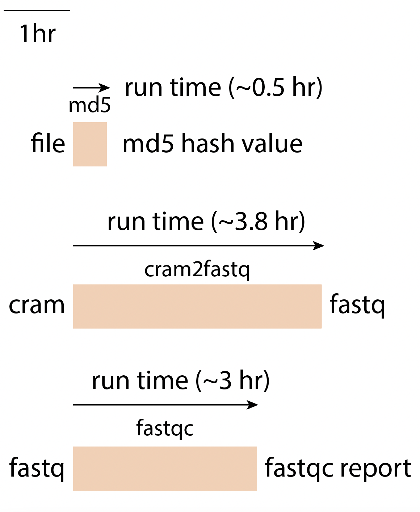

======================
Overview - Base Module
======================

The CGAP Pipeline Base Module (https://github.com/dbmi-bgm/cgap-pipeline-base) contains the CWL files, workflows, metaworkflows, Dockerfiles and CGAP Portal objects necessary to run ``md5``, ``fastqc``, and format conversion from ``cram`` to ``fastq``. This module is necessary for general CGAP Portal functionality and should always be included when deploying a new CGAP account.

Docker Images
#############

The Dockerfiles provided in this GitHub repository can be used to build public docker images, or if built through ``cgap-pipeline-utils`` ``deploy_pipeline.py`` (https://github.com/dbmi-bgm/cgap-pipeline-utils), private ECR images will be created for the provided AWS account.

The ``md5`` image contains (but is not limited to) the following software packages:

- md5sum (8.25)

The ``fastqc`` image contains (but is not limited to) the following software packages:

- fastqc (0.11.9)

The ``cram2fastq`` image contains (but is not limited to) the following software packages:

- bwa (0.7.17)
- gatk4 (4.1.2.0)
- picard (2.20.2)
- granite (0.1.12)
- bamsnap (0.2.19)
- samtools (1.9)
- bcftools (1.11)
- cramtools (0b5c9ec)
- pigz (2.4)
- pbgzip (2b09f97)
- vep (101)
- peddy (0.4.7)

Pipeline Flow
#############

Coming soon ...

Pipeline Parts and Runtimes
###########################

Below are the current runtimes for components of CGAP Pipeline Base.

