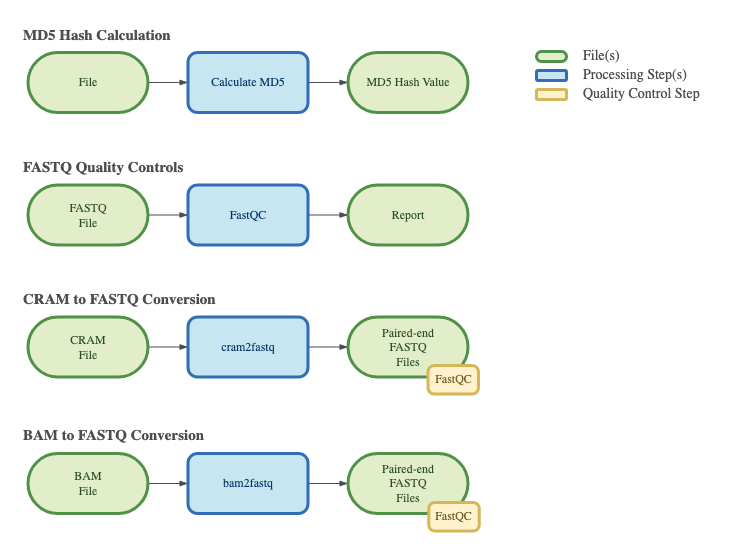

===============
Overview - Base
===============

The CGAP Pipelines base module (https://github.com/dbmi-bgm/cgap-pipeline-base) contains the CWL description files, Dockerfiles, *Workflow*, *MetaWorkflow* and other shared CGAP Portal objects necessary to run general pipelines (e.g., MD5 Hash and FastQC) and format conversions (e.g., ``cram`` or ``bam`` to paired-end ``fastq`` files).
This module is necessary for general CGAP Portal functionality and should always be included when deploying pipelines to a new account.

Docker Images
#############

The Dockerfiles provided in this GitHub repository can be used to build public docker images.
If built through ``cgap-pipeline-utils`` ``pipeline_deploy`` command (https://github.com/dbmi-bgm/cgap-pipeline-utils), private ECR images will be created for the target AWS account.

The ``md5`` image contains (but is not limited to) the following software packages:

- md5sum (8.25)

The ``fastqc`` image contains (but is not limited to) the following software packages:

- fastqc (0.11.9)

The ``base`` image contains (but is not limited to) the following software packages:

- samtools (1.9)
- cramtools (0b5c9ec)
- bcftools (1.11)
- pigz (2.6)
- pbgzip (2b09f97)

The ``gatk_picard`` image contains (but is not limited to) the following software packages:

- gatk4 (4.2.6.1)
- picard (2.26.11)

The ``granite`` image contains (but is not limited to) the following software packages:

- granite-suite (0.2.0)

Pipelines Overview
##################

Pipelines currently available in the module.

Pipelines Description
#####################

.. toctree::
   :maxdepth: 1

   Pages/md5
   Pages/fastqc
   Pages/cram2fastq
   Pages/bam2fastq
   Pages/liftover
