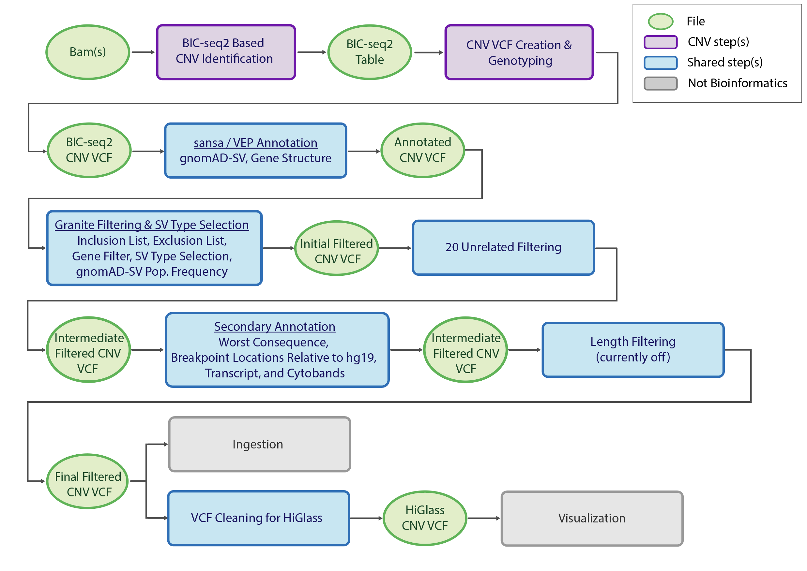

=======================
Overview - CNV Germline
=======================

The CGAP Pipeline for Germline Copy Number Variants (CNVs) (development: https://github.com/dbmi-bgm/cgap-pipeline-CNV-germline; current location: https://github.com/dbmi-bgm/cgap-pipeline-SV-germline) identifies, annotates, and filters CNVs starting from short read sequencing alignment files (``bam``) and produces ``vcf`` files as output.

CNVs are a class of large genomic variants that result in a change in copy number, including deletions (also referred to as losses) and duplications (also referred to as gains). CNVs are identified by algorithms that seek out aberrant differences in sequencing coverage.

CNVs are related to another class of large genomic variants, Structural Variants (SVs), which also includes deletions, duplications, translocations, inversions and other complex events, but SVs do not necessarily result in a change in copy number. SVs are identified by algorithms that seek out aberrantly mapping reads, including read pairs with unexpected fragment sizes, mapping orientation, and hard or soft clipping (e.g., split reads). CNV algorithms are better at identifying larger variants (e.g., trisomy of a chromosome) since they do not rely on information specific to read pairs, but less powerful for the smaller events due to lack of precise information, like split read locations. Many SVs are CNVs and vice versa, but there are also SVs that are not CNVs, and CNVs that are not SVs. Given this division, CGAP has implemented both a CNV and SV algorithm for identification of large-scale deletions and duplications in the germline genome.

The CGAP Germline CNV Pipeline is mostly based on an in-house CNV calling algorithm: ``BIC-seq2`` (https://www.math.pku.edu.cn/teachers/xirb/downloads/software/BICseq2/BICseq2.html and https://academic.oup.com/nar/article/44/13/6274/2457607), alongside annotation programs:  ``ensembl-vep`` (https://github.com/Ensembl/ensembl-vep) and  ``sansa`` (https://github.com/dellytools/sansa), and a ``vcf`` filtering program: ``granite`` (https://github.com/dbmi-bgm/granite).

The CGAP Pipeline CNV Germline is designed for proband-only analysis, with the proband diagnosed with a likely monogenic disease. It can receive the initial analysis ready ``bam`` file from either of the `CGAP WGS Upstream Pipelines <https://cgap-pipeline-main.readthedocs.io/en/latest/Pipelines/Upstream/Upstream_pipelines.html>`_.

**Note**: CGAP Pipeline CNV Germline is not optimized for Whole Exome Sequencing (WES) data. Currently, the ``bam`` files used for input must be generated by mapping 150 bp paired-end reads to **hg38**.

Docker Images
#############

The Dockerfiles provided in this GitHub repository can be used to build public docker images, or if built through ``cgap-pipeline-utils`` ``deploy_pipeline.py`` (https://github.com/dbmi-bgm/cgap-pipeline-utils), private ECR images will be created for the provided AWS account.

The ``cnv_germline`` image is primarily for **CNV identification**. This image contains (but is not limited to) the following software packages:

- BICseq2 normalization (0.2.6)
- BICseq2 segmentation (0.7.3)
- R (3.2.3)
- granite (0.1.13)
- picard (2.20.2)
- samtools (1.7)
- vcftools (0.1.17, 954e607)

The ``sv_germline`` image is shared with the CGAP Pipeline for Germline SVs, and is used for **annotation and filtering of CNVs**. This image contains (but is not limited to) the following software packages:

- granite (0.1.13)
- bcftools (1.11)
- vep (101)
- sansa (0.0.8, a30e1a7)
- vcftools (0.1.17, 954e607)

Pipeline Flow and Runtimes
##########################

The overall flow and duration of the CGAP CNV Germline Pipeline is shown below:

Pipeline Parts
##############

Largely, the pipeline consists of three parts:

  | Part 1. Beginning from analysis ready ``bam`` file generated by either of the available ``upstream pipelines`` of the `CGAP WGS Upstream Pipelines <https://cgap-pipeline-main.readthedocs.io/en/latest/Pipelines/Upstream/Upstream_pipelines.html>`_, or provided by the user, normalized coverage differences are identified using ``BIC-seq2`` and are converted to genotyped CNVs within a ``vcf`` file through ``bic-seq2_vcf_formatter.py``.
  | Part 2. Annotation of CNVs with ``VEP`` for transcripts and ``sansa`` for gnomAD-SV allele frequencies.
  | Part 3. Filtering of CNVs to remove non-relevant variants, false positives, and common variants.

Pipeline Steps
##############

.. toctree::
   :maxdepth: 4

   Pages/CNV_germline-step-part-1
   Pages/CNV_germline-step-part-2
   Pages/CNV_germline-step-part-3
