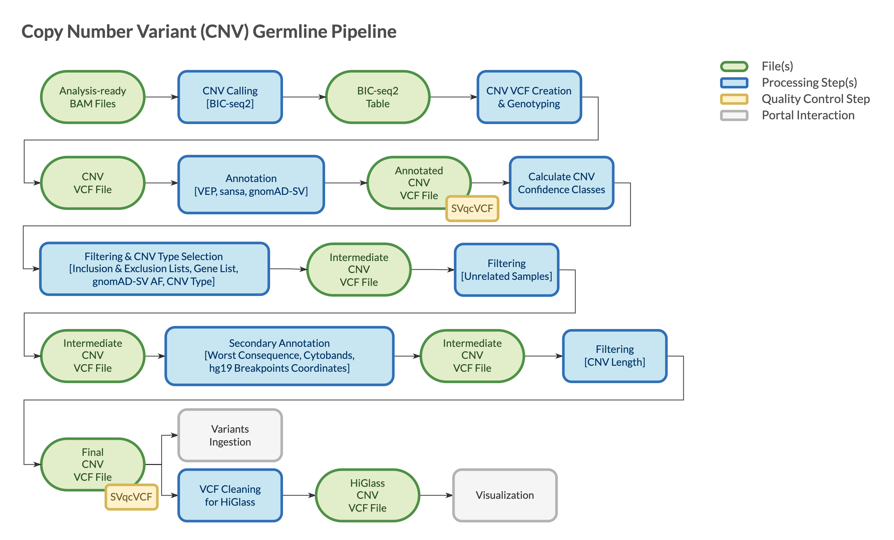

=======================
Overview - CNV Germline
=======================

The CGAP Pipelines module for germline Copy Number Variants (CNVs) (https://github.com/dbmi-bgm/cgap-pipeline-SV-germline) identifies, annotates, and filters CNVs starting from analysis-ready ``bam`` files to produce final sets of calls in ``vcf`` format.

CNVs are a class of large genomic variants that include deletion and duplication events resulting in a copy number change.
CNVs are a type of Structural Variants (SVs), which also includes inversions, translocations, and other complex genomic changes.
However, it's useful to maintain a separate classification to account for the differences between the algorithms used for their detection.
SV calling algorithms rely on local information from anomalously mapping reads (e.g., read pairs with unexpected fragment sizes, mapping orientations, and clipping events).
CNV calling algorithms search instead for unexpected variation in sequencing coverage.
As a result, algorithms for CNV detection perform better and are more robust in the identification of larger events, as they don’t rely on local context information, but are less powerful and accurate than SV algorithms in the detection of smaller events.
Given these substantial differences, CGAP implements both SV and a CNV calling algorithms, with the goal to combine the strength of both algorithmic approaches for an integrated analysis of the structural variation in the germline genome.

The pipeline is mostly based on the CNV calling algorithm BICseq2, alongside software for variants annotation and filtering (ensembl-vep, Sansa and granite).

The pipeline is designed for proband-only analysis, with the proband diagnosed with a likely monogenic disease. It can receive the initial analysis-ready ``bam`` file from either of the `CGAP Upstream modules <https://cgap-pipeline-main.readthedocs.io/en/latest/Pipelines/Upstream/Upstream_pipelines.html>`_.

**Note**: The pipeline is not optimized for Whole Exome Sequencing (WES) data.
Currently, the ``bam`` files used for input must be generated by mapping 150 bp paired-end reads to **hg38/GRCh38** genome assembly.
The mappability file used by BICseq2 was generated on **hg38/GRCh38**, as well as the other reference files used in the annotation steps.
The mappability file was calculated considering 150 bp reads.

Docker Images
#############

The Dockerfiles provided in this GitHub repository can be used to build public docker images.
If built through ``portal-pipeline-utils`` ``pipeline_deploy`` command (https://github.com/dbmi-bgm/portal-pipeline-utils), private ECR images will be created for the target AWS account.

The ``cnv_germline`` image is primarily for **CNV identification**.
This image contains (but is not limited to) the following software packages:

- BICseq2 normalization (0.2.6)
- BICseq2 segmentation (0.7.3)
- R (4.1.0)
- granite (0.2.0)
- picard (2.26.11)
- samtools (1.9)

Pipeline Flow
#############

The overall flow of the pipeline is shown below:

Pipeline Parts
##############

Largely, the pipeline consists of three parts:

  | Part 1. Starting from an analysis-ready ``bam`` file, BICseq2 algorithm identifies differences in coverage that are eventually converted to genotyped CNVs in ``vcf`` format using ``bic_seq2_vcf_formatter.py`` script
  | Part 2. CNVs are annotated using VEP (Ensembl Variant Effect Predictor) to add transcripts information and Sansa to add gnomAD SV allele frequencies
  | Part 3. CNVs are filtered to remove non-functional variants, artifacts, and variants that are common in the population

``vcf`` files are checked for integrity using VCFtools ``vcf-validator`` at the end of each step during which they are created or modified.

Pipeline Steps
##############

.. toctree::
   :maxdepth: 4

   Pages/CNV_germline-step-part-1
   Pages/CNV_germline-step-part-2
   Pages/CNV_germline-step-part-3

References
##########

`BICseq2 <https://www.math.pku.edu.cn/teachers/xirb/downloads/software/BICseq2/BICseq2.html>`__.
`ensembl-vep <https://github.com/Ensembl/ensembl-vep>`__.
`Sansa <https://github.com/dellytools/sansa>`__.
`granite <https://github.com/dbmi-bgm/granite>`__.
`VCFtools <https://vcftools.github.io/index.html>`__.
