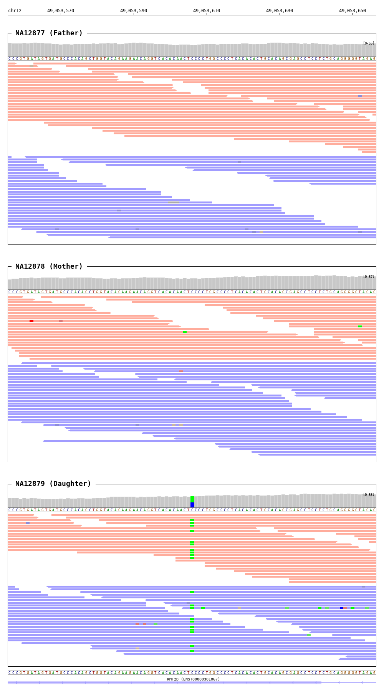

=======
Bamsnap
=======

This step uses bamsnap to generate a zip archive of IGV-like snapshots with reads information for all the variants and the samples in the target ``vcf`` file.

* CWL: bamsnap.cwl

Output
++++++

An example output for a snapshot (``png``):

References
++++++++++

`bamsnap <https://github.com/dbmi-bgm/bamsnap>`__.
