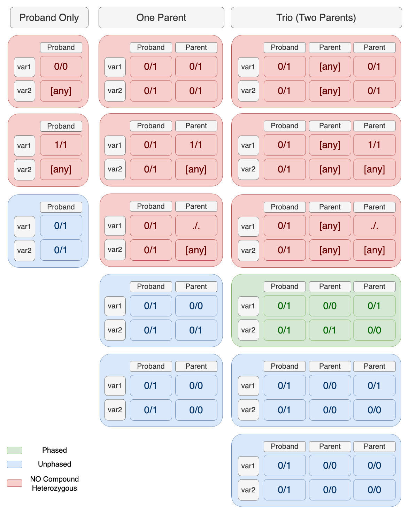

===============================
Compound Heterozygous Mutations
===============================

This step uses ``granite comHet`` to call compound heterozygous mutations by genes and transcripts, assigning the associate risk based on available annotations. The output ``vcf`` file is checked for integrity to ensure the format is correct and the file is not truncated.

* CWL: workflow_granite-comHet_plus_vcf-integrity-check.cwl

Requirements
++++++++++++

The input ``vcf`` must have annotations from VEP (consequence, gene and transcript are required). If the annotations also include impact, the software uses it. If not, an existing table calculated for consequences is used instead (https://m.ensembl.org/info/genome/variation/prediction/predicted_data.html).

Specifications
++++++++++++++

Gene Assignments
----------------

To determine compound heterozygous pairs, variants must be first assigned to genes and transcripts. For consistent and inclusive gene assignment, the rules are as follow:

  1. Intronic variants are not assigned to the corresponding gene or transcript, with the exception of variants predicted as potential splice sites (SpliceAI) or ClinVar variants.
  2. Variants that are upstream or downstream of the coding region are not assigned to the corresponding gene or a transcript, withe the exception of ClinVar variants.

A correct gene assignment is ensured by first 'cleaning' the pre-existing annotations based on spliceAI and ClinVar annotations.
This 'cleaning' is performed during the filtering step of the pipeline.
This calling step assumes that VEP annotations in the input ``vcf`` already respect the above rules.

Output
++++++

The output ``vcf`` contains the same variants as the input file (no line is removed), but with additional information added by the caller to variants that are potentially compound heterozygous. This additional information is in the following format:

::

    comHet=<Phased_or_Unphased>|<gene_id>|<transcript_id>|<gene_impact_of_comphet_pair>|<transcript_impact_of_comphet_pair>|<mate_variant>

An example:

::

    comHet=Phased|ENSG00000084636|ENST00000373672~ENST00000488897|STRONG_PAIR|STRONG_PAIR|chr1:31662352G>A

A corresponding header is added to the output ``vcf`` file.

::

    ##INFO=<ID=comHet,Number=.,Type=String,Description="Putative compound heterozygous pairs. Subembedded:'cmpHet':Format:'phase|gene|transcript|impact_gene|impact_transcript|mate_variant'">

Gene vs Transcript
------------------

A compound heterozygous pair is defined for each pair of variants and for each gene.
If a variant forms a compound heterozygous pair on two or more genes, the output will have a corresponding number of ``cmpHet`` entries.
Compound heterozygous pairs not always share transcripts, and shared transcript for each pair are listed as additional information in the ``transcript`` field.

Phase
-----

A compound heterozygous pair is either classified as Phased or Unphased.

Impact
------

The predicted impact of a compound heterozygous pair is calculated as follow:

    1. If VEP impact for both variants is HIGH ('H') or MODERATE ('M'), SpliceAI score >=0.8 ('S') or ClinVar Pathogenic or Likely Pathogenic ('C'), the pair is called a STRONG_PAIR.

    2. If only one of the variants is H, M, S or C, the pair is called a MEDIUM_PAIR.

    3. If none of the above, the pair is called a WEAK_PAIR.

The impact is calculated both at the gene level (gene impact) and at the transcript level (transcript impact).

Report
++++++

This step also generates a report that provides additional information on the compound heterozygous pairs that are called. The report contains statistics on the total number of pairs and their distribution by genes, transcripts, and predicted impact.

By genes
--------

For each gene, the program reports the number of compound heterozygous pairs called for the gene (``name``), together with the number of transcripts and variants involved.
In each category, it is reported the total number of elements that are involved in a compound heterozygous pair, as well as the total number of elements involved in a pair that is also Phased.

::

    "by_genes": [
      {
        "name": "ENSG00000004455",
        "pairs": {
            "phased": 0,
            "total": 1
        },
        "transcripts": {
            "phased": 0,
            "total": 11
        },
        "variants": {
            "phased": 0,
            "total": 2
        }
      },
      ...
    ]

By transcripts
--------------

For each transcript, the program reports the number of compound heterozygous pairs called for the transcript (``name``), together with the number of variants involved and the gene to which the transcript belongs.
In each category, it is reported the total number of elements that are involved in a compound heterozygous pair, as well as the total number of elements involved in a pair that is also Phased.

::

    "by_transcripts": [
      {
        "name": "ENST00000218200",
        "gene": "ENSG00000102081",
        "pairs": {
           "phased": 3,
           "total": 6
        },
        "variants": {
           "phased": 4,
           "total": 4
        }
      },
      ...
    ]

By impact
---------

For each impact, the program reports the number of compound heterozygous pairs predicted with that impact (``name``) as the worst possible impact, together with the number of genes, transcripts and variants involved.
In each category, it is reported the total number of elements that are involved in a compound heterozygous pair, as well as the total number of elements involved in a pair that is also Phased.

::

    "by_impact": [
        {
          "name": "MEDIUM_PAIR",
          "pairs": {
              "phased": 28,
              "total": 44
          },
          "genes": {
              "phased": 23,
              "total": 34
          },
          "transcripts": {
              "phased": 55,
              "total": 81
          },
          "variants": {
              "phased": 51,
              "total": 78
          }
        },
        ...
      ]
