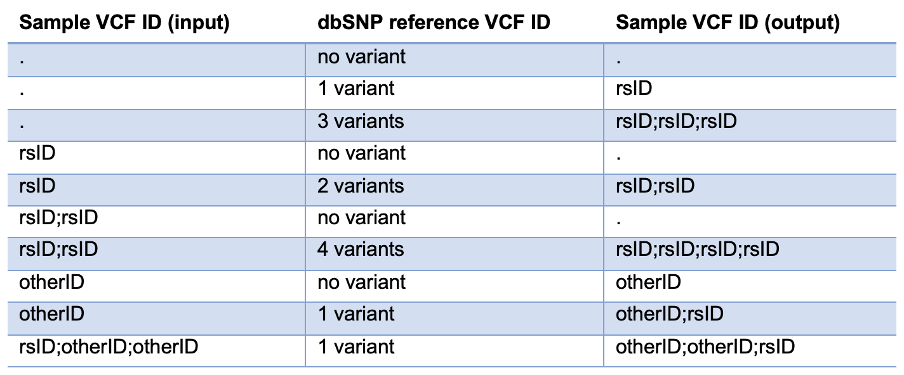

=================
dbSNP rsID Update
=================

This step uses ``parallel_dbSNP_ID_fixer.sh`` to run ``dbSNP_ID_fixer.py`` and update dbSNP rsIDs in a sample ``vcf`` file's ID column. The output ``vcf`` file is checked for integrity.

* CWL: workflow_parallel_dbSNP_ID_fixer_plus_vcf-integrity-check.cwl

Requirements
++++++++++++

Must be run on input ``vcf`` following ``bcftools norm`` since it only allows one variant per line in the input ``vcf``.

Output
++++++

This process follows the following rules:

  1. Variants in the input ``vcf`` are matched to the reference dbSNP ``vcf`` by CHROM, POS, REF, and ALT columns.
  2. All rsIDs in the input ``vcf`` ID column are discarded and replaced by the IDs found in the reference dbSNP ``vcf``.
  3. Given a known bug where ``bcftools norm`` leaves an erroneous rsID at multi-allelic sites, this will sometimes result in replacing an existing (but wrong) rsID with ``.``.
  4. When multiple dbSNP rsIDs exist for a single CHROM, POS, REF, and ALT in the dbSNP reference ``vcf``, we include them all separated by ``;``.  In our testing, we came across multiple cases where the same variant is associated with multiple rsIDs. In some cases it was possible to chose a parent one to which the others link to, but in other cases, it was not possible to find a link between the different rsIDs for variants that appear to be identical. gnomAD (https://gnomad.broadinstitute.org/help) described similar issues with dbSNP within their database. Taking the safer approach, we decided to include all possible rsIDs for a given variant at this stage.
  5. If a variant has a non-rsID within the ID column, it is not discarded and will be appended at the beginning of the ``;``-delimited list of any and all rsIDs from the reference dbSNP ``vcf``.

An example of how these rules are followed with various inputs is found below:

For more details, see https://cgap-annotations.readthedocs.io/en/latest/variants_sources.html#dbsnp
