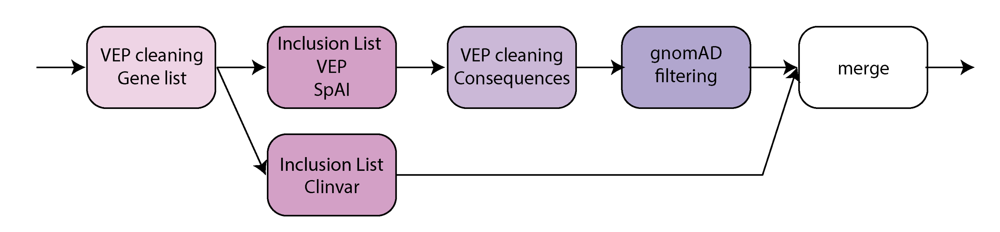

=================
Variant Filtering
=================

This workflow filters variants in the input ``vcf`` file based on annotations.
The filtering is mostly implemented using granite.
The output ``vcf`` file is checked for integrity to ensure the format is correct and the file is not truncated.

* CWL: workflow_granite-filtering_plus_vcf-integrity-check.cwl

Requirements
++++++++++++

The expected input is a single annotated ``vcf`` file with variant calls.
Annotations must include VEP, ClinVar and SpliceAI.

This step can optionally use a panel of unrelated samples in ``big`` format to filter-out variants with reads supporting an alternate allele in the panel.
This option is currently not used in the pipeline.
See granite documentation for more information on ``big`` format.

Steps
+++++

The workflow consists of multiple steps as show below.

Gene List
---------

This intermediate step uses granite to clean VEP annotations for transcripts that are not mapping to any gene of interest (the list of genes currently available in the CGAP Portal is `here`_).
This step does not remove any variant and only modifies the VEP annotations.

.. _here: https://cgap-reference-file-registry.s3.amazonaws.com/84f2bb24-edd7-459b-ab89-0a21866d7826/GAPFI5MKCART.txt

Inclusion List
--------------

This intermediate step uses granite to filter-in exonic and functionally relevant variants based on VEP, ClinVar, and SpliceAI annotations.
The ClinVar Inclusion list is applied separately and the variants that are rescued do not undergo any further processing by VEP cleaning and Exclusion list.

Criteria to rescue a variant:

  - VEP: variant is exonic or annotated as a splice region, and functionally relevant (based on VEP consequences)
  - ClinVar: variant annotated as ``Pathogenic``, ``Likely Pathogenic``, ``Conflicting Interpretation of Pathogenicity``, or ``Risk Factor``
  - SpliceAI: max delta score >= 0.2

VEP Cleaning
------------

This intermediate step uses granite to clean VEP annotations and remove non-relevant consequences.
The step eventually discards variants that remain with no VEP annotations after the cleaning.

Exclusion List
--------------

This intermediate step uses granite to filter-out common and shared variants based on gnomAD population allele frequency (``AF`` > 0.01) and/or a panel of unrelated samples (optional, not used currently).

Merging
-------

This intermediate step merges the set of variants from ClinVar Inclusion list with the other set of fully-filtered variants.
For variants that overlap between the two sets, the variant from ClinVar Inclusion list set is maintained to preserve the most complete annotations.

Output
++++++

The final output is a filtered ``vcf`` file containing a subset of variants from the initial ``vcf`` file.
The information attached to filtered variants is the same as in the original variants, with the exception of VEP annotations that have been cleaned to remove non-relevant transcripts and consequences.

References
++++++++++

`granite <https://github.com/dbmi-bgm/granite>`__.
