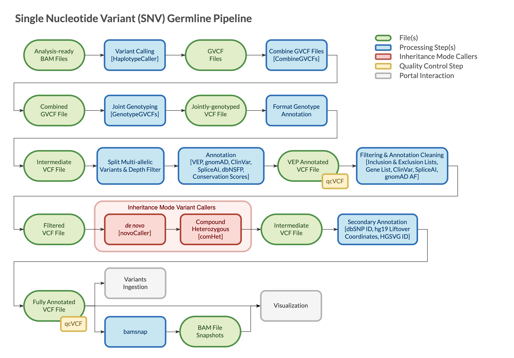

=======================
Overview - SNV Germline
=======================

The CGAP Pipelines module for germline Single Nucleotide Variants (SNVs) (https://github.com/dbmi-bgm/cgap-pipeline-SNV-germline) processes Whole Genome Sequencing (WGS) and Whole Exome Sequencing (WES) data starting from analysis-ready ``bam`` files, and produces ``g.vcf`` and ``vcf`` files containing SNVs and short Insertions and Deletions (INDELs) as output.

The pipeline supports analysis-ready ``bam`` files generated by mapping raw reads from both WGS and WES sequencing runs to **hg38/GRCh38** genome build.
It can receive the initial ``bam`` file(s) from either of the `CGAP Upstream modules <https://cgap-pipeline-main.readthedocs.io/en/latest/Pipelines/Upstream/Upstream_pipelines.html>`_.
The pipeline can also receive ``vcf`` file(s) directly as initial input.
**hg38/GRCh38** ``vcf`` file(s) are supported out-of-the box.
**hg19/GRCh37** ``vcf`` file(s) require an extra step to lift-over the coordinates to **hg38/GRCh38** genome build (https://github.com/dbmi-bgm/cgap-pipeline-base).

The WGS configuration is designed for a trio analysis with proband diagnosed with a likely monogenic disease.
It is optimized for data with 30x coverage and has been tested with data up to 80-90x coverage.
It can also be run in proband-only, and family modes.
The WES configuration is a recent extension of the WGS pipeline, which allows for the processing of WES data.
It is optimized for 90x coverage and tested with data ranging from 20 to 200x coverage.

Docker Images
#############

The Dockerfiles provided in this GitHub repository can be used to build public docker images.
If built through ``cgap-pipeline-utils`` ``pipeline_deploy`` command (https://github.com/dbmi-bgm/cgap-pipeline-utils), private ECR images will be created for the target AWS account.

The ``snv_germline_gatk`` image is primarily for **calling and genotyping variants**.
This image contains (but is not limited to) the following software packages:

- gatk (4.2.6.1)

The ``snv_germline_granite`` image is primarily for **filtering and annotating variants**.
This image contains (but is not limited to) the following software packages:

- granite (0.2.0)
- samtools (1.9)

The ``snv_germline_misc`` image is primarily for **pipeline utilities**.
This image does not use the base image provided in the CGAP Pipelines main repository, as some of the software requires an older version of Python.
This image contains (but is not limited to) the following software packages:

- python (3.6.8)
- bamsnap-cgap (0.3.0)
- peddy (0.4.7)
- granite (0.2.0)

The ``snv_germline_tools`` image is primarily for **pipeline utilities**.
This image contains (but is not limited to) the following software packages:

- vcftools (0.1.17, 954e607)
- bcftools (1.11)

The ``snv_germline_vep`` image is primarily for **annotating variants**.
This image contains (but is not limited to) the following software packages:

- vep (101)

Pipeline Flow
#############

The overall flow of the pipeline is shown below:

Pipeline Parts
##############

Both the WGS and WES configurations of the pipeline are mostly based on GATK4, granite, ensembl-vep and bamsnap and are built following `GATK best practices <https://gatk.broadinstitute.org/hc/en-us/articles/360035535932-Germline-short-variant-discovery-SNPs-Indels->`_.
The pipelines:

  - Call variants per sample
  - Combine the calls to jointly-genotype within a trio or family (if NOT proband-only)
  - Annotate and filter the calls
  - Refine *de novo* and compound heterozygous calls by running inheritance mode callers
  - Generate snapshot images for the final set of variants

``vcf`` files are checked for integrity using VCFtools ``vcf-validator`` at the end of each step during which they are created or modified.

Pipeline Steps
##############

.. toctree::
   :maxdepth: 1

   Pages/SNV_germline-step-haplotypecaller
   Pages/SNV_germline-step-combinegvcfs
   Pages/SNV_germline-step-genotypegvcf
   Pages/SNV_germline-step-mpileup
   Pages/SNV_germline-step-rcktar
   Pages/SNV_germline-step-samplegeno
   Pages/SNV_germline-step-vep
   Pages/SNV_germline-step-filtering
   Pages/SNV_germline-step-denovo
   Pages/SNV_germline-step-comhet
   Pages/SNV_germline-step-dbSNP
   Pages/SNV_germline-step-hg19LO-hgvsg
   Pages/SNV_germline-step-bamsnap

References
##########

`GATK4 <https://gatk.broadinstitute.org/hc/en-us>`__.
`ensembl-vep <https://github.com/Ensembl/ensembl-vep>`__.
`bamsnap <https://github.com/dbmi-bgm/bamsnap>`__.
`granite <https://github.com/dbmi-bgm/granite>`__.
`VCFtools <https://vcftools.github.io/index.html>`__.
