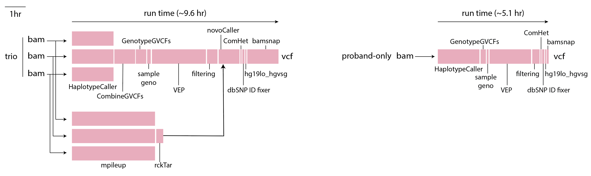

=====================================
Overview - CGAP Pipeline SNV Germline
=====================================

CGAP Pipeline SNV Germline (https://github.com/dbmi-bgm/cgap-pipeline-SNV-germline) processes Whole Genome Sequencing (WGS) and Whole Exome Sequencing (WES) data starting from ``bam`` files and produces ``g.vcf`` and ``vcf`` files containing variant calls as output.

The CGAP Pipeline SNV Germline supports ``bam`` files generated by mapping raw reads from both WGS and WES sequencing runs. The WGS configuration is designed for a trio analysis with proband diagnosed with a likely monogenic disease. It is optimized for data with 30x coverage and has been tested with data up to 80-90x coverage. It can also be run in proband-only, and family modes using appropriate metaworkflows.

The WES configuration is a recent extension of the WGS pipeline, which allows for the processing of WES data. We are currently optimizing for 90x coverage and testing from 20x-200x.

Both the WES and WGS configurations of the CGAP Pipeline SNV Germline are mostly based on ``gatk4``, ``granite`` (https://github.com/dbmi-bgm/granite), ``ensembl-vep`` (https://github.com/Ensembl/ensembl-vep) and ``bamsnap`` (https://github.com/parklab/bamsnap). The pipelines perform joint-sample variant calling within a family, perform annotation and filtering, call *de novo* mutations and compound hets, and generate snapshot images for the filtered set of variants.

Docker Image
############

The Dockerfile provided in this GitHub repository can be used to build a public docker image, or if built through ``cgap-pipeline-utils`` ``deploy_pipeline.py`` (https://github.com/dbmi-bgm/cgap-pipeline-utils) a private ECR image will be created for the provided AWS account.

The image contains (but is not limited to) the following software packages:

- bwa (0.7.17)
- gatk4 (4.1.2.0)
- picard (2.20.2)
- granite (0.1.12)
- bamsnap (0.2.19)
- samtools (1.9)
- bcftools (1.11)
- cramtools (0b5c9ec)
- pigz (2.4)
- pbgzip (2b09f97)
- vep (101)
- peddy (0.4.7)

Pipeline Flow
#############

The overall flow of the pipeline looks as below:

.. image:: ../../../images/bioinfo-snv-indel-flow-v22-20210526.png

Pipeline Parts and Runtimes
###########################

The CGAP Pipeline SNV Germline is primarily used for variant calling following GATK Best Practice, after which time variants are annotated and filtered.

The run time of the different steps are summarized in the following diagram:

Pipeline Steps
##############

.. toctree::
   :maxdepth: 1

   Pages/SNV_germline-step-haplotypecaller
   Pages/SNV_germline-step-combinegvcfs
   Pages/SNV_germline-step-genotypegvcf
   Pages/SNV_germline-step-mpileup
   Pages/SNV_germline-step-rcktar
   Pages/SNV_germline-step-samplegeno
   Pages/SNV_germline-step-vep
   Pages/SNV_germline-step-filtering
   Pages/SNV_germline-step-denovo
   Pages/SNV_germline-step-comhet
   Pages/SNV_germline-step-dbSNP
   Pages/SNV_germline-step-hg19LO-hgvsg
   Pages/SNV_germline-step-bamsnap

Pipeline Validation
###################

.. toctree::
  :maxdepth: 2

  validation-SNV_germline
