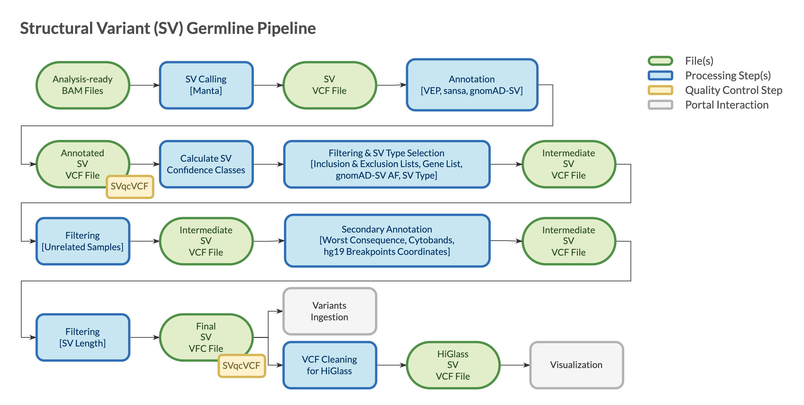

======================
Overview - SV Germline
======================

The CGAP Pipelines module for germline Structural Variants (SVs) (https://github.com/dbmi-bgm/cgap-pipeline-SV-germline) identifies, annotates, and filters SVs starting from analysis-ready ``bam`` files to produce final sets of calls in ``vcf`` format.

SVs are a class of large genomic variants that includes deletions, duplications, translocations, inversions and other complex events, generally with a size of 50 bp or longer.
SVs are identified by algorithms that seek out aberrantly mapping reads, including read pairs with unexpected fragment sizes, mapping orientations, and hard or soft clipping events (e.g., split reads).
SVs are related to another class of large genomic variants, Copy Number Variants (CNVs).
CNVs include deletions (also referred to as losses) and duplications (also referred to as gains), that result in a copy number change.
CNVs are included in the broader definition of SVs.
However, it's useful to maintain a separate classification to account for the differences between the algorithms used for their detection.
CNVs are identified by algorithms that search for unexpected variation in sequencing coverage.
As a result, algorithms for CNV detection perform better and are more robust in the identification of larger events, as they don’t rely on local context information, but are less powerful and accurate than SV algorithms in the detection of smaller events.
Given these substantial differences, CGAP implements both SV and a CNV calling algorithms, with the goal to combine the strength of both algorithmic approaches for an integrated analysis of the structural variation in the germline genome.

The pipeline is mostly based on the SV calling algorithm Manta, alongside software for variants annotation and filtering (ensembl-vep, Sansa and granite).

The pipeline is designed for proband-only or trio analysis, with the proband diagnosed with a likely monogenic disease.
It can receive the initial ``bam`` file(s) from either of the `CGAP Upstream modules <https://cgap-pipeline-main.readthedocs.io/en/latest/Pipelines/Upstream/Upstream_pipelines.html>`_.
The pipeline can also receive ``vcf`` file(s) directly as initial input.
**hg38/GRCh38** ``vcf`` file(s) are supported out-of-the box.
**hg19/GRCh37** ``vcf`` file(s) require an extra step to lift-over the coordinates to **hg38/GRCh38** genome build (https://github.com/dbmi-bgm/cgap-pipeline-base).

For proband-only analysis, a single ``bam`` file is provided to Manta that runs a *Single Diploid Sample Analysis*, resulting in a ``vcf`` file containing SVs with genotypes for the proband.
For trio analysis, three ``bam`` files are provided to Manta that runs a *Joint Diploid Sample Analysis*, resulting in a single ``vcf`` file containing SVs with genotypes for all three individuals.

**Note**: The pipeline is not optimized for Whole Exome Sequencing (WES) data.
If the user is directly providing ``bam`` file(s) as input, the ``bam`` file(s) must be aligned to **hg38/GRCh38** for compatibility with the annotation steps.
Manta requires standard paired-end sequencing data and can't run on mate-pair data or data produced with more complex library preparation protocols.

Docker Images
#############

The Dockerfiles provided in this GitHub repository can be used to build public docker images.
If built through ``portal-pipeline-utils`` ``pipeline_deploy`` command (https://github.com/dbmi-bgm/portal-pipeline-utils), private ECR images will be created for the target AWS account.

The ``manta`` image is primarily for **SVs identification**.
This image does not use the base image provided in the CGAP Pipelines main repository, as some of the software requires an older version of Python.
This image contains (but is not limited to) the following software packages:

- python (2.7.13)
- manta (1.6.0)
- samtools (1.9)

The ``sv_germline_granite`` image is for **SVs annotation and filtering**.
This image contains (but is not limited to) the following software packages:

- granite (0.2.0)
- pyliftover (0.4)

The ``sv_germline_tools`` image is for **SVs annotation**.
This image contains (but is not limited to) the following software packages:

- vcftools (0.1.17, 954e607)
- bcftools (1.11)
- sansa (0.0.8, a30e1a7)

The ``sv_germline_vep`` image is for **SVs annotation**.
This image contains (but is not limited to) the following software packages:

- vep (101)

Pipeline Flow
#############

The overall flow of the pipeline is shown below:

Pipeline Parts
##############

Largely, the pipeline consists of three parts:

  | Part 1. Starting from analysis-ready ``bam`` file(s), Manta calls SVs in ``vcf`` format
  | Part 2. SVs are annotated using VEP (Ensembl Variant Effect Predictor) to add transcripts information and Sansa to add gnomAD SV allele frequencies
  | Part 3. SVs are filtered to remove non-functional variants, artifacts, and variants that are common in the population

``vcf`` files are checked for integrity using VCFtools ``vcf-validator`` at the end of each step during which they are created or modified.

Pipeline Steps
##############

.. toctree::
   :maxdepth: 4

   Pages/SV_germline-step-part-1
   Pages/SV_germline-step-part-2
   Pages/SV_germline-step-part-3

References
##########

`Manta <https://github.com/Illumina/manta>`__.
`ensembl-vep <https://github.com/Ensembl/ensembl-vep>`__.
`Sansa <https://github.com/dellytools/sansa>`__.
`granite <https://github.com/dbmi-bgm/granite>`__.
`VCFtools <https://vcftools.github.io/index.html>`__.
