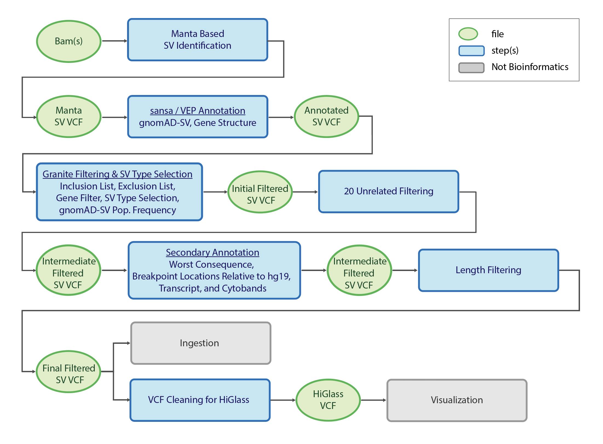
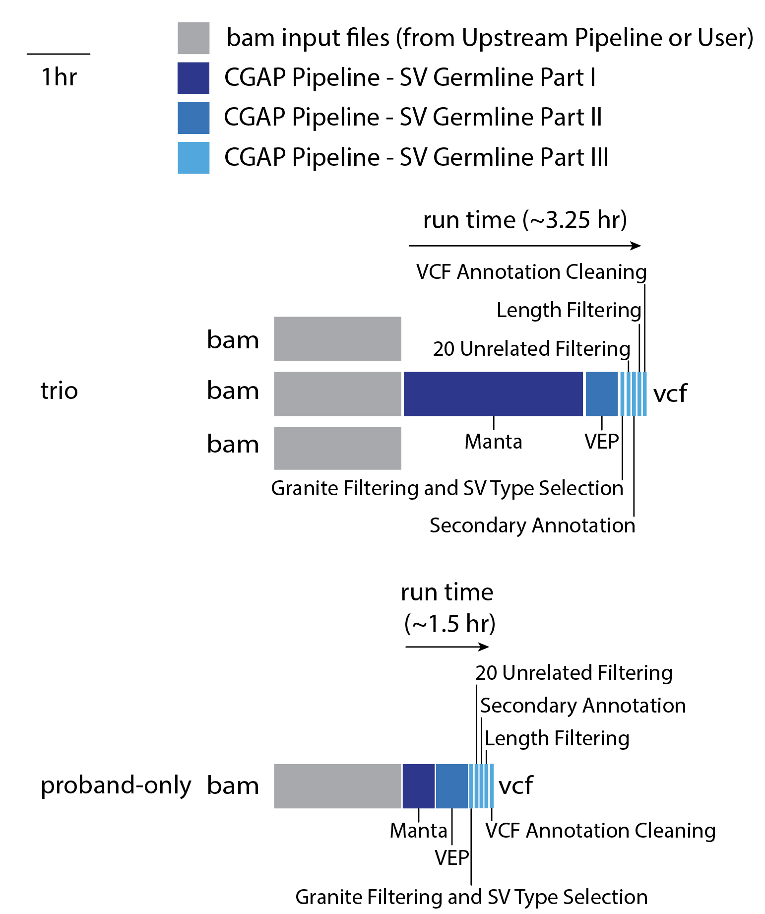

======================
Overview - SV Germline
======================

The CGAP Pipeline for Germline Structural Variants (SVs) (https://github.com/dbmi-bgm/cgap-pipeline-SV-germline) identifies, annotates, and filters SVs starting from short read sequencing alignment files (``bam``) and produces ``vcf`` files as output.

SVs are a class of large genomic variants that includes deletions, duplications, translocations, inversions and other complex events, generally with a size of 50 bp or longer. SVs are identified by algorithms that seek out aberrantly mapping reads, including read pairs with unexpected fragment sizes, mapping orientations, and hard or soft clipping (e.g., split reads). SVs are related to another class of large genomic variants, Copy Number Variants (CNVs). CNVs include deletions (also referred to as losses) and duplications (also referred to as gains), which always results in a change in copy number (e.g., a heterozygous deletion would result in a single copy loss). CNVs are identified by algorithms that seek out aberrant difference in sequencing coverage. This makes CNV algorithms better at identifying larger variants (e.g., trisomy of a chromosome), since they do not rely on information specific to read pairs, but less powerful for the smaller events due to lack of precise local information, like split read locations. Many SVs are CNVs and vice versa, but there are also SVs that are not CNVs, and CNVs that are not SVs. Given this division, CGAP has implemented both an SV and CNV algorithm for identification of large-scale deletions and duplications in the germline genome.

The CGAP Germline SV Pipeline is mostly based on an SV calling algorithm: ``Manta`` (https://github.com/Illumina/manta), annotation programs:  ``ensembl-vep`` (https://github.com/Ensembl/ensembl-vep) and  ``sansa`` (https://github.com/dellytools/sansa), and a ``vcf`` filtering program: ``granite`` (https://github.com/dbmi-bgm/granite).

The CGAP Pipeline SV Germline is designed for proband-only or trio analysis, with the proband diagnosed with a likely monogenic disease. It can receive the initial analysis ready ``bam`` file(s) from either of the `CGAP WGS Upstream Pipelines <https://cgap-pipeline-main.readthedocs.io/en/latest/Pipelines/Upstream/Upstream_pipelines.html>`_.
The pipeline can also receive ``vcf`` file(s) directly as initial input. **hg38** ``vcf`` file(s) are supported out-of-the box. **hg19/GRCh37** ``vcf`` file(s) require an extra step to lift-over the coordinates to **hg38** genome reference build (https://github.com/dbmi-bgm/cgap-pipeline-base).

**Note**: CGAP Pipeline SV Germline is not optimized for Whole Exome Sequencing (WES) data. Also, if the user is providing their own ``bam`` file(s) as input, the ``bam`` file(s) must be mapped to **hg38** for compatibility with the annotation steps. ``Manta`` requires standard paired-end sequencing data and can't run on mate-pair data or data produced with more complex library preparation protocols.

For proband-only analysis, a single ``bam`` file is provided to ``Manta`` and ``Single Diploid Sample Analysis`` is carried out, resulting in a ``vcf`` file containing SVs with genotypes for the proband. For trio analysis, three ``bam`` files are provided to ``Manta`` and ``Joint Diploid Sample Analysis`` is carried out, resulting in a single ``vcf`` file containing SVs with genotypes for all three individuals.

The pipeline then performs annotation and filtering of SVs from that ``vcf`` file. ``vcf`` files are checked for integrity using ``vcftools`` ``vcf-validator`` at the end of any step during which they are created or modified.

Docker Images
#############

The Dockerfiles provided in this GitHub repository can be used to build public docker images, or if built through ``cgap-pipeline-utils`` ``deploy_pipeline.py`` (https://github.com/dbmi-bgm/cgap-pipeline-utils), private ECR images will be created for the provided AWS account.

The ``manta`` image is primarily for **SV identification**. This image is one of the few that does not use the base image provided in the CGAP Pipeline Main repository due to requiring an older version of python. This image contains (but is not limited to) the following software packages:

- python (2.7.13)
- manta (1.6.0)
- samtools (1.9)

The ``sv_germline_granite`` image is for **annotation and filtering of SVs**. This image contains (but is not limited to) the following software packages:

- granite (0.2.0)
- pyliftover (0.4)

The ``sv_germline_tools`` image is for **annotation of SVs**. This image contains (but is not limited to) the following software packages:

- vcftools (0.1.17, 954e607)
- bcftools (1.11)
- sansa (0.0.8, a30e1a7)

The ``sv_germline_vep`` image is for **annotation of SVs**. This image contains (but is not limited to) the following software packages:

- vep (101)

Pipeline Flow
#############

The overall flow of the pipeline is shown below:

Pipeline Parts and Runtimes
###########################

Largely, the pipeline consists of three parts:

  | Part 1. Beginning from analysis ready ``bam`` file(s) generated by either of the available ``upstream pipelines`` of the `CGAP WGS Upstream Pipelines <https://cgap-pipeline-main.readthedocs.io/en/latest/Pipelines/Upstream/Upstream_pipelines.html>`_, or provided by the user, SVs are identified using ``Manta``.
  | Part 2. Annotation of SVs with ``VEP`` for transcripts and ``sansa`` for gnomAD-SV allele frequencies.
  | Part 3. Filtering of SVs to remove non-relevant variants, false positives, common variants, and very long variants.

The run time of the different steps are summarized in the following diagram:

Pipeline Steps
##############

.. toctree::
   :maxdepth: 4

   Pages/SV_germline-step-part-1
   Pages/SV_germline-step-part-2
   Pages/SV_germline-step-part-3
