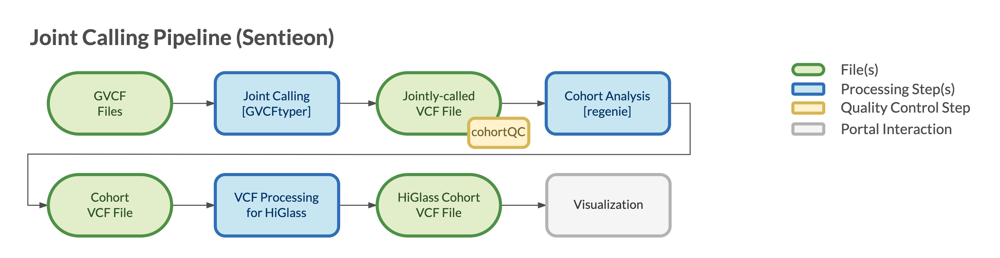

=================================
Overview - Sentieon Joint Calling
=================================

The CGAP Pipelines module for joint calling and genotyping with Sentieon (https://github.com/dbmi-bgm/cgap-pipeline-upstream-sentieon) accepts multiple individual ``g.vcf`` files and produces a jointly genotyped ``vcf`` file as output.
The ``g.vcf`` files can be generated through standard CGAP Pipelines processing (either of the `CGAP Upstream modules <https://cgap-pipeline-main.readthedocs.io/en/latest/Pipelines/Upstream/Upstream_pipelines.html>`_ followed by `HaplotypeCaller <https://cgap-pipeline-main.readthedocs.io/en/latest/Pipelines/Downstream/SNV_germline/Pages/SNV_germline-step-haplotypecaller.html>`_) or can be provided by the user.

This pipeline is based on Sentieon and the ``GVCFtyper`` algorithm is used to combine the ``g.vcf`` files and joint genotype the resulting variants.

Docker Image
############

The Dockerfiles provided in this GitHub repository can be used to build public docker images.
If built through ``portal-pipeline-utils`` ``pipeline_deploy`` command (https://github.com/dbmi-bgm/portal-pipeline-utils), private ECR images will be created for the target AWS account.

The image contains (but is not limited to) the following software packages:

- sentieon (202112.01)

Pipeline Flow
#############

The overall flow of the pipeline is shown below:

Pipeline Steps
##############

.. toctree::
   :maxdepth: 1

   Pages/sentieon_joint_calling-step-GVCFtyper

References
##########

`Sentieon <https://www.sentieon.com>`__.
