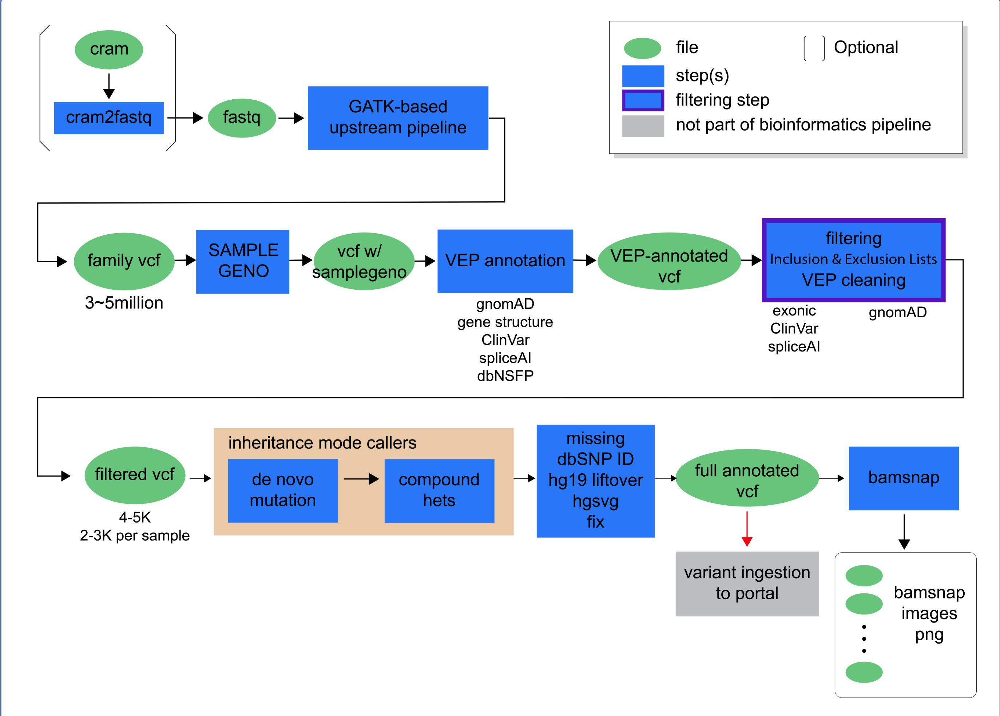
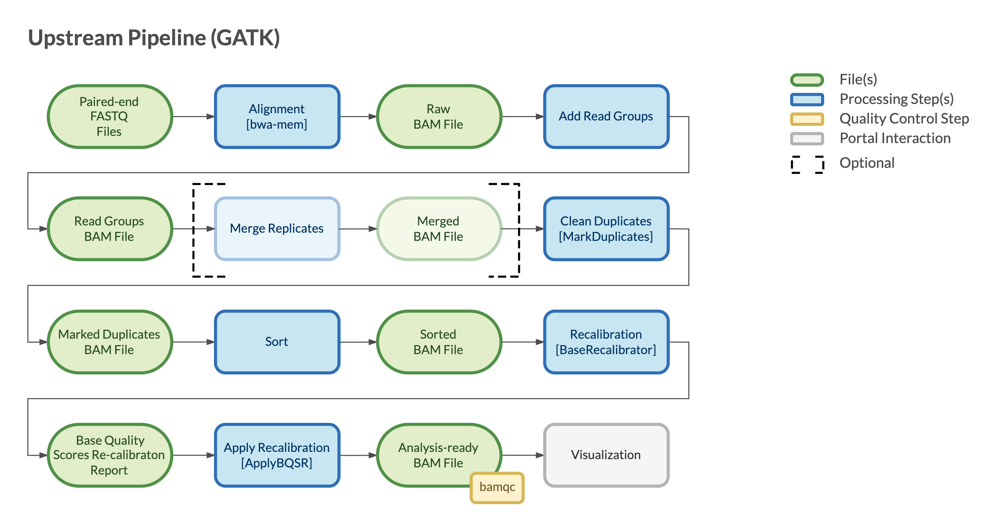

========================
Overview - Upstream GATK
========================

CGAP Pipeline Upstream GATK (https://github.com/dbmi-bgm/cgap-pipeline-upstream-GATK) is our open source option for processing Whole Genome Sequencing (WGS) and Whole Exome Sequencing (WES) datasets.  This pipeline begins with paired ``fastq`` files and produces ``bam`` files (mapped reads) which can be supplied to numerous CGAP downstream pipelines, including the SNV Germline and SV Germline Pipelines. We use **hg38** as the reference genome for read mapping. If the user wishes to provide ``cram`` files as input, these can first be converted to ``fastq`` files using the CGAP Pipeline Base module.

The CGAP Pipeline Upstream GATK supports both WGS and WES input files. The WGS configuration is designed for a trio analysis with proband diagnosed with a likely monogenic disease. It is optimized for data with 30x coverage and has been tested with data up to 80-90x coverage. It can also be run in proband-only, and family modes using appropriate metaworkflows.

The WES configuration is a recent extension of the WGS pipeline, which allows for the processing of WES data. We are currently optimizing for 90x coverage and testing from 20x-200x.

Both the WES and WGS configurations of the CGAP Pipeline Upstream GATK are mostly based on ``bwa`` and ``gatk4``. Users can select the correct pipeline configuration for their input data through the use of the corresponding metaworkflows (e.g., ``WES_upstream_gatk_proband.json`` for a single sample of WES data or ``WGS_upstream_gatk.json`` for a trio (mother, father, and proband) with WGS library preparation).

Docker Image
############

The Dockerfile provided in this GitHub repository can be used to build a public docker image, or if built through ``cgap-pipeline-utils`` ``deploy_pipeline.py`` (https://github.com/dbmi-bgm/cgap-pipeline-utils) a private ECR image will be created for the AWS account provided.

The image contains (but is not limited to) the following software packages:

- bwa (0.7.17)
- gatk4 (4.1.2.0)
- picard (2.20.2)
- granite (0.1.12)
- bamsnap (0.2.19)
- samtools (1.9)
- bcftools (1.11)
- cramtools (0b5c9ec)
- pigz (2.4)
- pbgzip (2b09f97)
- vep (101)
- peddy (0.4.7)

Pipeline Flow
#############

The overall flow of the pipeline looks as below:

Pipeline Parts and Runtimes
###########################

The CGAP Pipeline Upstream GATK is primarily used for read mapping from raw sequencing data, following GATK Best Practice.

The run time of the different steps are summarized in the following diagram:

Pipeline Steps
##############

.. toctree::
   :maxdepth: 2

   steps-upstream_GATK
