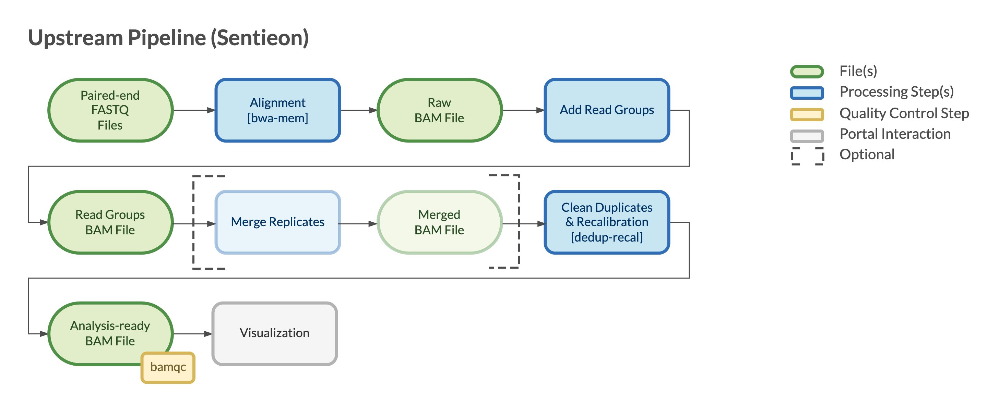

============================
Overview - Upstream Sentieon
============================

The CGAP Pipelines module for upstream processing with Sentieon (https://github.com/dbmi-bgm/cgap-pipeline-upstream-sentieon) is our *license-based* option for processing Whole Genome Sequencing (WGS) and Whole Exome Sequencing (WES) datasets.

The pipeline takes paired-end ``fastq`` files and produces analysis-ready ``bam`` files that can be used by any of the CGAP Pipelines downstream modules (e.g., SNV Germline and SV Germline).

The pipeline is based on **hg38/GRCh38** genome build and is optimized for 30x coverage for WGS data and 90x coverage for WES data.
It has been tested with WGS data up to 80-90x coverage and WES data ranging from 20 to 200x coverage.

The pipeline is based on Sentieon implementation of bwa and GATK4 algorithms, following `GATK best practices <https://gatk.broadinstitute.org/hc/en-us/articles/360035535932-Germline-short-variant-discovery-SNPs-Indels->`_.
Sentieon offers a faster and more computationally efficient implementation of the original algorithms.

**Note**: If the user wants to provide ``cram`` files as input, they must first be converted to paired-end ``fastq`` files using the CGAP Pipelines base module (https://github.com/dbmi-bgm/cgap-pipeline-base).

Docker Image
############

The Dockerfiles provided in this GitHub repository can be used to build public docker images.
If built through ``cgap-pipeline-utils`` ``pipeline_deploy`` command (https://github.com/dbmi-bgm/cgap-pipeline-utils), private ECR images will be created for the target AWS account.

The ``upstream_sentieon`` image contains (but is not limited to) the following software packages:

- Sentieon (202112.01)
- samtools (1.9)

Pipeline Flow
#############

Our implementation offers an end-to-end solution to process raw sequencing data, producing an analysis-ready ``bam`` file as described `here <https://support.sentieon.com/manual/DNAseq_usage/dnaseq/#step-by-step-usage-for-dnaseq-reg>`_.
For more details see the documentation for `Upstream GATK module <https://cgap-pipeline-main.readthedocs.io/en/latest/Pipelines/Upstream/upstream_GATK/index-upstream_GATK.html>`_.
This pipeline follows the same logic and structure and simply replaces some of the open-source software with the equivalent Sentieon implementation.

The overall flow of the pipeline is shown below:

References
##########

`Sentieon <https://www.sentieon.com>`__.
`bwa <https://github.com/lh3/bwa>`__.
`GATK4 <https://gatk.broadinstitute.org/hc/en-us>`__.
