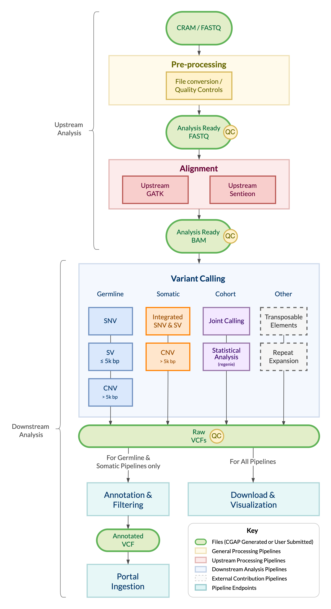

==============
CGAP Pipelines
==============

This is the main documentation for the Computational Genomic Analysis Platform (CGAP) bioinformatics pipelines.
The pipelines are developed following a modular approach and different modules can be combined to run a specific set of analyses.

The latest stable version for each of the available modules is bundled in the main pipelines repository.
Refer to this repository to deploy the pipeline components.

.. toctree::
 :maxdepth: 1

 overview-main
 news-main

The modules currently available:

.. toctree::
 :maxdepth: 1

 Pipelines/Base/index-base

.. toctree::
 :maxdepth: 2

 Pipelines/Upstream/Upstream_pipelines

.. toctree::
 :maxdepth: 3

 Pipelines/Downstream/Downstream_pipelines

.. toctree::
 :maxdepth: 2

 Pipelines/Other/Other_pipelines
 Pipelines/Support/Support_repos
