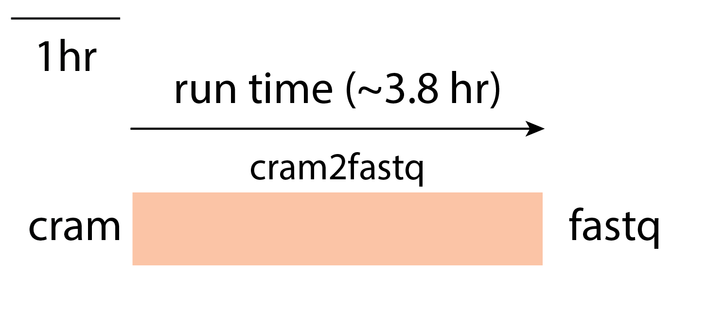

=============================
Overview - CGAP Pipeline Base
=============================

CGAP Pipeline Base contains the CWL files, workflows, metaworkflows, Dockerfiles and CGAP Portal objects necessary to run ``md5``, ``fastqc``, and format conversion from ``cram`` to ``fastq``. This module is necessary for general CGAP Portal functionality and should always be included when deploying a new CGAP account.

Docker Images
#############

The Dockerfiles provided in this GitHub repository can be used to build public docker images, or if built through ``cgap-pipeline-utils`` ``deploy_pipeline.py`` (https://github.com/dbmi-bgm/cgap-pipeline-utils), private ECR images will be created for the provided AWS account.

The ``md5`` image contains (but is not limited to) the following software packages:

- md5sum (8.25)

The ``fastqc`` image contains (but is not limited to) the following software packages:

- fastqc (0.11.9)

COMING SOON - The ``cram2fastq`` image and information.

Pipeline Flow
#############

Coming soon ...

Pipeline Parts and Runtimes
###########################

Below are the current runtimes for components of CGAP Pipeline Base.

